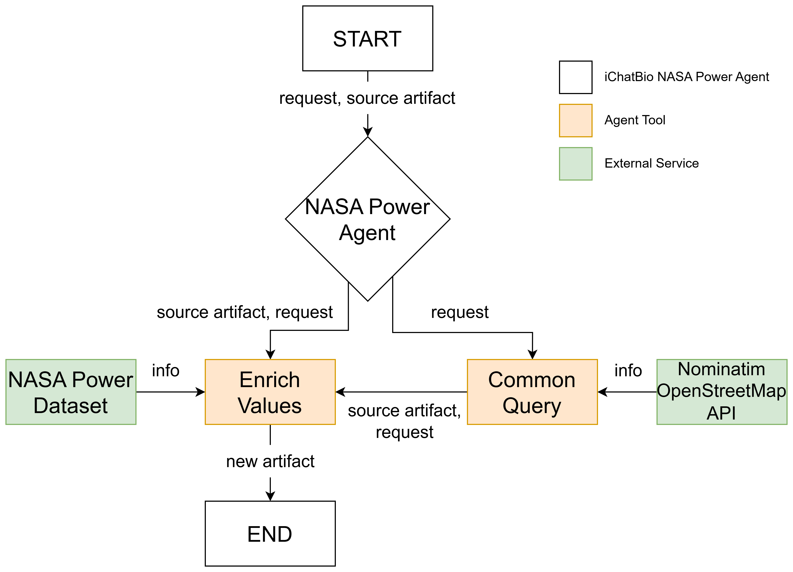

# NASA POWER Data Agent

An AI-powered data enrichment agent that augments biological and geospatial datasets with weather and climate information from NASA's [Prediction Of Worldwide Energy Resources (POWER)](https://power.larc.nasa.gov/).

Built as part of the **iChatBio multi-agent ecosystem**, the agent automatically transforms species occurrence records into climate-aware datasets that can support biodiversity analysis, ecological research, and downstream AI workflows.

## Problem

Biological datasets often contain what species were observed, where they were found, and when they were recorded, but they typically lack environmental context.

Without weather and climate variables such as temperature, humidity, precipitation, and solar radiation, researchers have limited ability to study how environmental conditions influence biodiversity and species distribution.

This project bridges that gap by automatically attaching NASA POWER climate measurements to location records.

## Architecture

### Dataset enrichment workflow

1. Receive a user request and optional iChatBio artifacts
2. Extract latitude, longitude, and observation dates
3. Validate records and skip unsupported dates
4. Query NASA POWER APIs for environmental variables
5. Attach climate measurements to each record
6. Generate a new enriched artifact for downstream AI agents and analytics



The agent also supports **direct user questions**. For example:

> *"What was the temperature in Gainesville, Florida, on April 20, 2026?"*

The system automatically:

- Geocodes the location
- Creates temporary records
- Retrieves NASA POWER data
- Returns structured results without requiring a dataset

## Example Environmental Variables


| Parameter     | Description         |
| ------------- | ------------------- |
| `T2M`         | Temperature at 2 m  |
| `T2M_MAX`     | Maximum temperature |
| `T2M_MIN`     | Minimum temperature |
| `RH2M`        | Relative humidity   |
| `PRECTOTCORR` | Precipitation       |
| `WS2M`        | Wind speed          |
| `PS`          | Surface pressure    |


See the [full NASA POWER parameter catalog](https://power.larc.nasa.gov/parameters/) for additional variables.

## Example Use Cases

- Biodiversity analysis
- Species distribution studies
- Ecological research
- Climate-aware machine learning datasets
- Environmental impact studies
- AI-assisted scientific workflows

## Why This Project Matters

This project demonstrates experience with:

- AI agents
- Data engineering
- REST API integration
- Workflow automation
- Geospatial data processing
- Batch processing
- Scientific computing
- Python web services
- Testing and quality engineering
- Building components within a multi-agent architecture

---

## Developer Guide

### Agent structure


| Field                | Type                   | Description                                                                                                                                                  |
| -------------------- | ---------------------- | ------------------------------------------------------------------------------------------------------------------------------------------------------------ |
| `locations_artifact` | `Artifact` (optional)  | iChatBio artifact containing location records (e.g. species occurrences). When provided, the agent extracts latitude, longitude, and dates from each record. |
| `address`            | `str` (optional)       | Address or place name to geocode when no artifact is supplied. Used with date fields to build temporary location records from a natural-language question.   |
| `weather_parameters` | `List[str]`            | NASA POWER parameters to retrieve (e.g. `T2M`, `RH2M`, `PRECTOTCORR`).                                                                                       |
| `day`                | `List[str]` (optional) | Day(s) of the month for query-based lookups (integer strings, e.g. `["20"]`).                                                                                |
| `month`              | `List[str]` (optional) | Month(s) for query-based lookups (integer strings, e.g. `["4"]`). Required when no artifact is provided.                                                     |
| `year`               | `List[str]` (optional) | Year(s) for query-based lookups. If omitted, the agent uses the three most recent calendar years.                                                            |
| `start_range_date`   | `str` (optional)       | Start date for a date-range query (e.g. `2026-04-01`). Used with `end_range_date` and `address`.                                                             |
| `end_range_date`     | `str` (optional)       | End date for a date-range query (e.g. `2026-04-30`).                                                                                                         |
| `source`             | `str`                  | NASA POWER data source.                                                                                                                                      |
| `temporal`           | `str`                  | Temporal aggregation mode passed to the NASA POWER API.                                                                                                      |
| `time`               | `str`                  | Time standard for retrieved values.                                                                                                                          |


### Getting started

**Prerequisites:** Python 3.12+, [uv](https://github.com/astral-sh/uv) or `pip`

```bash
cd ichatbio-nasa-power-agent
python3 -m venv venv
source venv/bin/activate
pip install -e .
uvicorn src.agent:create_app --factory --host 0.0.0.0 --port 9999
```

**Docker Compose** (host port **29203** → container **9999**):

```bash
docker compose up --build
```

### Testing

```bash
python -m pytest -v
python -m pytest tests/test_nasa_power_data.py -v
```

Allure eval reports:

```bash
python3.13 -m pip install allure-pytest
python3.13 -m pytest -vv tests/evals/eval_assistant/test_nasa_power_agent.py --alluredir=allure-results
```

### Security & privacy

- No authentication required for NASA POWER (public data)
- Read-only access to S3 bucket
- No user data stored
- No API keys required for NASA POWER data

### References

- [NASA POWER Website](https://power.larc.nasa.gov/)
- [NASA POWER Documentation](https://power.larc.nasa.gov/docs/)
- [iChatBio SDK Documentation](https://github.com/acislab/ichatbio-sdk/)
- [Zarr Documentation](https://zarr.readthedocs.io/)

### License

This project uses publicly available NASA POWER data. Please refer to NASA's data usage policies for more information.